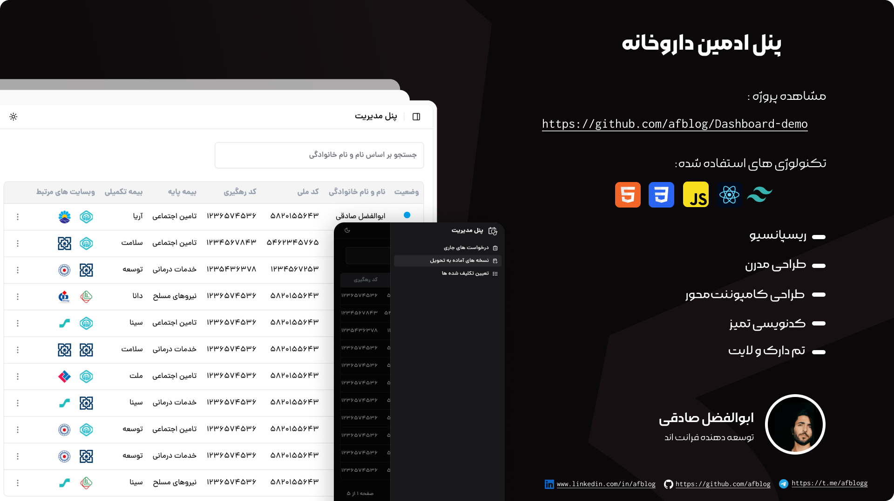

# Professional Admin Dashboard (Online Version)
A fully responsive and customizable admin panel with support for both dark and light themes. Designed for performance, personalization, and a seamless user interface.

This is a preview of a professional admin dashboard project. The source code is private — feel free to contact me if you’re interested in access, collaboration, or licensing.

 

  **Online Demo Available:** [View Live Version](https://rainbow-gelato-85fe4c.netlify.app/)

> 🌐🔒 **Note:** If the demo link doesn’t open, please turn on your VPN — the hosting provider (Netlify) may be restricted in your region.
